  
  
  

**游戏系统 · 原生工具 · 逆向工程** 
I explore how software works beneath the surface, then turn that understanding into practical tools and game mods.

## `> stack --load`

  

## `> languages --overview`

<picture>
  <source media="(prefers-color-scheme: dark)" srcset="https://raw.githubusercontent.com/InitLoader/InitLoader/output/languages.svg" />
  <source media="(prefers-color-scheme: light)" srcset="https://raw.githubusercontent.com/InitLoader/InitLoader/output/languages.svg" />
  
</picture>

## `> github --telemetry`

<picture>
  <source media="(prefers-color-scheme: dark)" srcset="https://github-profile-summary-cards.vercel.app/api/cards/profile-details?username=InitLoader&theme=github_dark" />
  <source media="(prefers-color-scheme: light)" srcset="https://github-profile-summary-cards.vercel.app/api/cards/profile-details?username=InitLoader&theme=default" />
  
</picture>

 

<picture>
  <source media="(prefers-color-scheme: dark)" srcset="https://github-profile-summary-cards.vercel.app/api/cards/stats?username=InitLoader&theme=github_dark" />
  <source media="(prefers-color-scheme: light)" srcset="https://github-profile-summary-cards.vercel.app/api/cards/stats?username=InitLoader&theme=default" />
  
</picture>
<picture>
  <source media="(prefers-color-scheme: dark)" srcset="https://github-readme-streak-stats-eight.vercel.app?user=InitLoader&hide_border=true&background=00000000&ring=65e6ff&fire=a78bfa&currStreakLabel=65e6ff&sideLabels=cbd5e1&dates=64748b&currStreakNum=f8fafc&sideNums=f8fafc" />
  <source media="(prefers-color-scheme: light)" srcset="https://github-readme-streak-stats-eight.vercel.app?user=InitLoader&hide_border=true&background=00000000&ring=0369a1&fire=7c3aed&currStreakLabel=0369a1&sideLabels=334155&dates=64748b&currStreakNum=0f172a&sideNums=0f172a" />
  
</picture>

 

<picture>
  <source media="(prefers-color-scheme: dark)" srcset="https://github-profile-summary-cards.vercel.app/api/cards/most-commit-language?username=InitLoader&theme=github_dark" />
  <source media="(prefers-color-scheme: light)" srcset="https://github-profile-summary-cards.vercel.app/api/cards/most-commit-language?username=InitLoader&theme=default" />
  
</picture>

## `> contributions --animate`

<picture>
  <source media="(prefers-color-scheme: dark)" srcset="https://raw.githubusercontent.com/InitLoader/InitLoader/output/github-contribution-grid-snake-dark.svg" />
  <source media="(prefers-color-scheme: light)" srcset="https://raw.githubusercontent.com/InitLoader/InitLoader/output/github-contribution-grid-snake.svg" />
  
</picture>

自动生成于 GitHub Actions · Updated automatically by GitHub Actions

 

<samp>INITIALIZE → INSPECT → UNDERSTAND → BUILD</samp>

  

